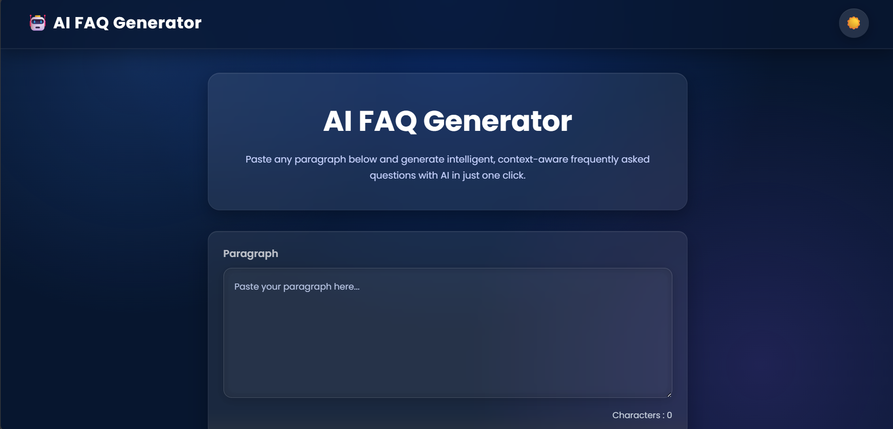
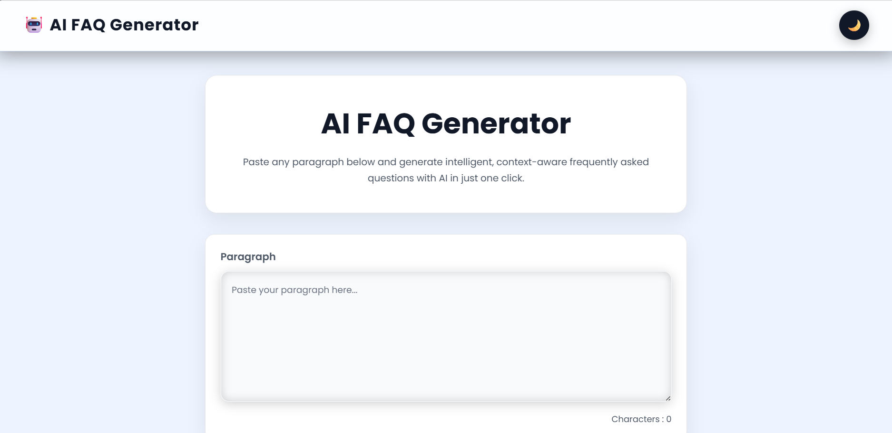
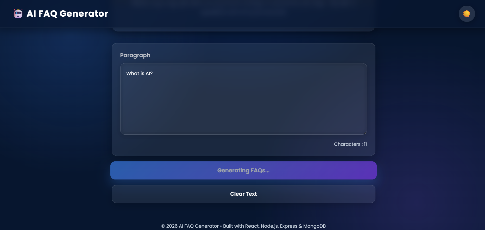
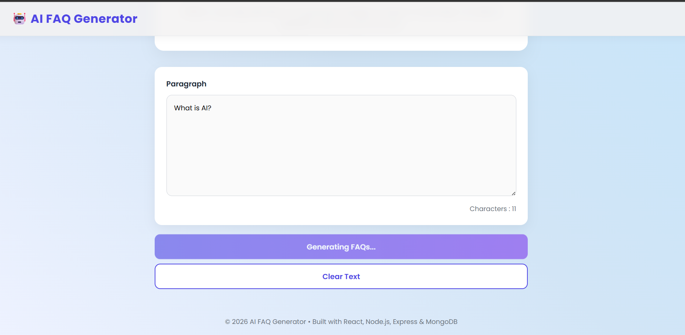
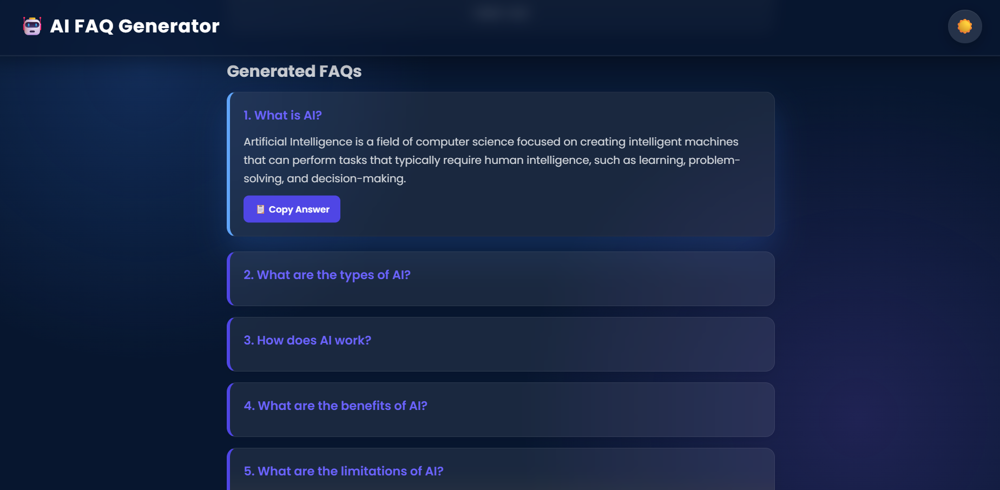
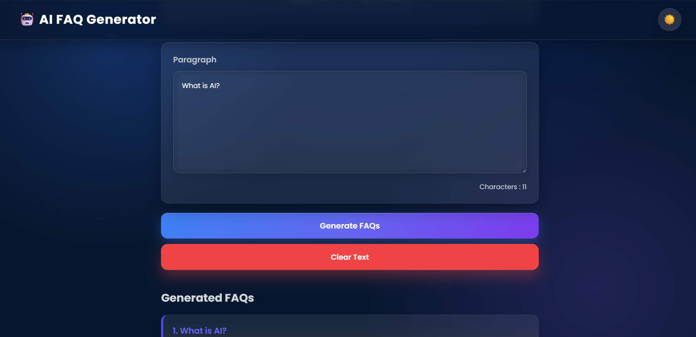
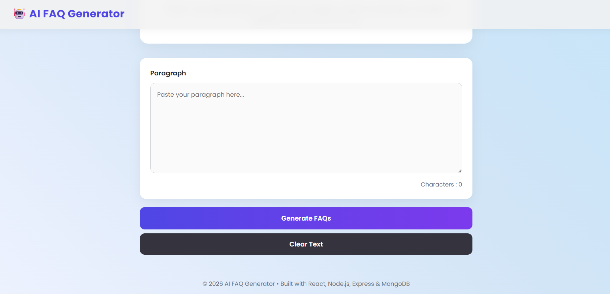

# 🤖 AI FAQ Generator

An AI-powered web application that automatically generates **3–5 Frequently Asked Questions (FAQs)** with answers from any paragraph of text. The application uses **Groq AI** for fast and accurate FAQ generation and provides a clean, responsive user interface.

--- 


## 🚀 Live Demo
https://gauri9368gupta-maker.github.io/AI-FAQ-Generator/

##📂 GitHub Repository
https://github.com/gauri9368gupta-maker/AI-FAQ-Generator

## 📸 Preview








---

## ✨ Features

- 🤖 AI-powered FAQ generation
- 📝 Paste any paragraph to generate FAQs
- 📋 Copy generated answers with one click
- 📂 Accordion-style FAQ layout
- ⚡ Fast response using Groq AI
- 🎨 Clean and responsive UI
- 🔄 Loading state while generating FAQs
- 🗑️ Clear input functionality
- 📱 Mobile-friendly design

---

## 🛠️ Tech Stack

### Frontend

- React.js
- CSS3
- JavaScript (ES6)
- Fetch API
- Async/Await

### Backend

- Node.js
- Express.js
- Groq AI API
- dotenv
- CORS

---

## 📁 Project Structure
```

---

## ⚙️ Installation

### Clone the Repository

```bash
git clone https://github.com/gauri9368gupta-maker/AI-FAQ-Generator.git
```

Move into the project folder

```bash
cd AI-FAQ-Generator
```

---

## Install Frontend Dependencies

```bash
cd client
npm install
```

Run the frontend

```bash
npm run dev
```

---

## Install Backend Dependencies

```bash
cd server
npm install
```

Run the backend

```bash
npm run dev
```

---

## Environment Variables

Create a `.env` file inside the **server** folder.

```env
PORT=5000

GROQ_API_KEY=YOUR_GROQ_API_KEY
```

---

## How It Works

1. User enters a paragraph.
2. Frontend sends the text to the Express backend.
3. Backend forwards the prompt to the Groq AI API.
4. AI generates 3–5 FAQs with answers.
5. Backend returns the response.
6. React displays the FAQs in an accordion layout.

---

## Future Improvements

- MongoDB integration for FAQ history
- User authentication
- Download FAQs as PDF
- Dark mode
- Multiple AI model support
- Search generated FAQs
- Voice input support

---

## 👩‍💻 Author

**Gauri Gupta**
GitHub: https://github.com/gauri9368gupta-maker

---  
